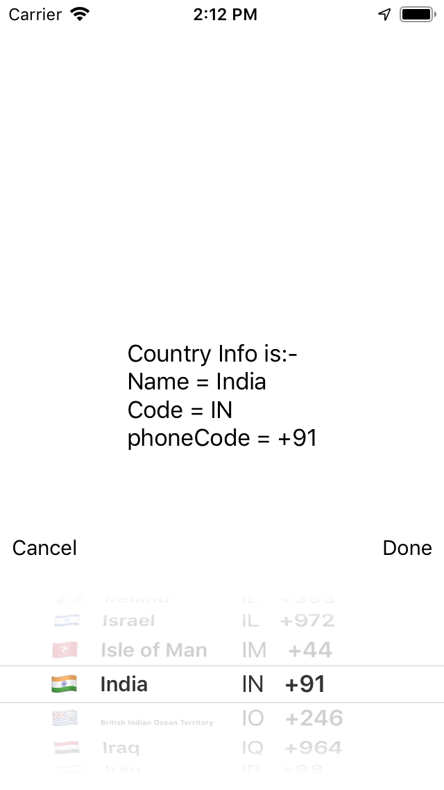

# SwiftyCountryPicker

[](https://travis-ci.org/anoopkumarevontech/SwiftyCountryPicker)
[](https://cocoapods.org/pods/SwiftyCountryPicker)
[](https://cocoapods.org/pods/SwiftyCountryPicker)
[](https://cocoapods.org/pods/SwiftyCountryPicker)

## Example

To run the example project, clone the repo, and run `pod install` from the Example directory first.
## Screen Shots:-
 
## Requirements

Library don't depeneds on any third party library.

## Installation

SwiftyCountryPicker is available through [CocoaPods](https://cocoapods.org). To install
it, simply add the following line to your Podfile:

```ruby
pod 'SwiftyCountryPicker'
```

## Basic configuration

1- Add a pickerView in your storyBoard.
2- From the attribute inspector set your pickerView class name to 
```ruby 
CountryPickerView 
```
3- Create outlet for your countryPicker in ViewController 

```ruby
@IBOutlet weak var pickerView:CountryPickerView!
```

3- On your view controller add the following code to setup countryPicker

```ruby
pickerView.setCountryPickerView(hideflag: false, countryName: false, countryCode: false, countrydialCode: false) 
```

4- You can add your own done and cancel button above the picker .
On done button press you can call the below closure to get the selected country. and other info.

```ruby 
pickerView.getSelctedCountry { (data) in print(data.countryCode)}
```


## Author

anpkmr, anup227kumar@gmail.com

## License

SwiftyCountryPicker is available under the MIT license. See the LICENSE file for more info.
